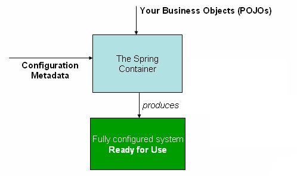
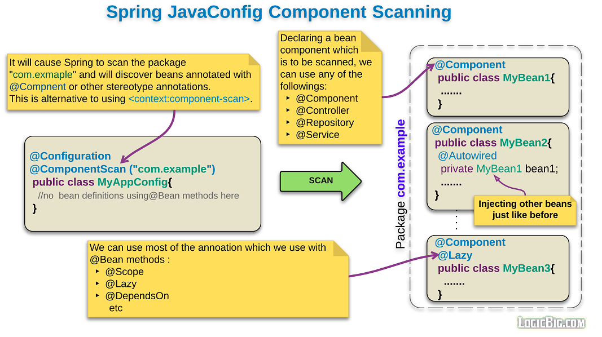
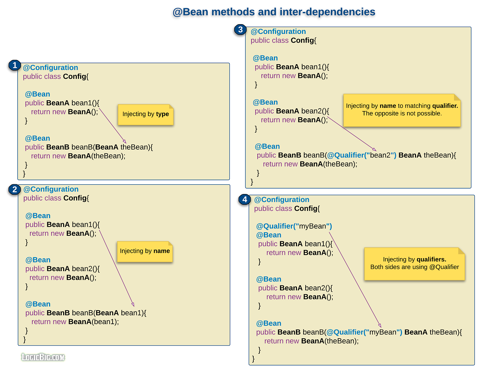
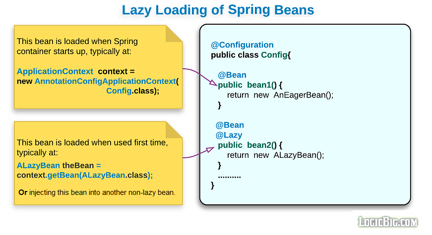

## Spring’s Inversion of Control (IoC) container: Java config

IoC is also known as dependency injection (DI). It is a process whereby objects define their dependencies (that is, the other objects they work with) 
only through constructor arguments, arguments to a factory method, or properties that are set on the object instance after it is constructed or returned 
from a factory method. The container then injects those dependencies when it creates the bean

Spring IoC container and is responsible for instantiating, configuring, and assembling the beans. The container gets its instructions on what objects 
to instantiate, configure, and assemble by reading configuration metadata. The configuration metadata is represented in XML, Java annotations,
or Java code. It lets you express the objects that compose your application and the rich interdependencies between those objects.

The following diagram shows a high-level view of how Spring works. Your application classes are combined with configuration metadata so that,
after the ApplicationContext is created and initialized, you have a fully configured and executable system or application.

As the preceding diagram shows, the Spring IoC container consumes a form of configuration metadata. This configuration metadata 
represents how you, as an application developer, tell the Spring container to instantiate, configure, and assemble the objects in your application.

### Important annotation to be discussed to define bean with Java config or annotation based config:

1. @Configuration + @Bean
2. @SpringbootApplication = @Configuration + @ComponentScan
3. @Component. @Repository, @Service, and @Controller
4. @Autowired 
5. @Inject
6. @PostConstruct 
7. @PreDestroy
8. initMethod 
9. destroyMethod
10. @Lazy 
11. @DependsOn
12. @Conditional.... For example: @ConditionalOnProperty(value="module.enabled", havingValue = "true", matchIfMissing = true)
13. @Scope
14. @Autowired + @Qualifier:
15. @Resource = @Autowired+ @Qualifier:
16. @Inject + @ Qualifier= @Autowired+ @Qualifier:
17. @Inject + @Named
18. @Primary
19. @Order
20. @Lookup

## Configuration Metadata: How to create the bean in spring: 

### @Configuration + @Bean

The basic structure of creating bean using @Configuration in the class and @Bean in the method like following

    @Configuration
    public class BeanConfig {
        @Bean()
        public SomeBean someBean() {
            // instantiate, configure and return bean instance ...
            return new SomeBeanImpl();
        }
    }

    In Above example someBean consider as bean. @Bean can have multiple parameter for example: . 
    @Bean(value = "bean1",autowire = Autowire.BY_NAME,initMethod = "",destroyMethod = "",autowireCandidate = false). 
    With @Bean annotation there can be other annotation to set the characteristics of the bean such as @Scope, @Lazy, @DependsOn and @Primary

    @Bean({"b1", "b2"}) // bean available as 'b1' and 'b2', but not 'myBean'
    @Profile("production") // 
    @Scope("prototype")
    @Lazy or @DependsOn("another bean")
    public MyBean myBean() {
      // instantiate and configure MyBean obj
      return obj;
    }

    To get the bean in another class we can use @Autowired. In the following class _Client_ class get the _dataSourceBean_ bean using @Autowired

    @Configuration
    public class DataSourceConfig {
        @Bean
        DataSourceBean dataSourceBean() {
            return new DataSourceBean();
        }
    }        
    
    @Configuration
    public class Client {
        @Autowired
        private DataSourceBean dataSourceBean;
        public void showData() {
            System.out.println(dataSourceBean.getData());
        }
    }
    In above Client class will invoke the  DataSourceConfig configuration to invoke the dataSourceBean bean method

### Bean creation with @Configuration + @ComponentScan + @Component
 

    Annoted @Configuration in class lebel and @Bean at the method lebel called factory approach, Without @Configuration and only @Bean is called lite-mode
    but it is also possible to create bean with stereotype annotation(**@component,@Service,@Repository,@Controller**), 
    fot this we need to use @Configuration with @ComponentScan. In spring boot @SpringBootApplication will use this two annotation implicitly by default.
    Annotate the class with any of Stereotype annotation will consider as a bean candidate; The following describes how bean will create with component

    Usually in @SpringbootApplication annotation will have @ComponenetScan which scan the class or packages that @ComponenetScan is annotated by
    but it can be customized like as follow: If specific packages are not defined, scanning will occur from the package of the class that declares this annotation.
    
    @SpringBootApplication
    //@ComponentScan(basePackages = {"com.example", "com.example1"}) // specifies packages to scan for annotated component
    //@ComponentScan(basePackageClasses = {Bean1.class, Bean2.class, }) //pecifies class to scan for annotated component
    public class SpringbasicApplication {
    }

### @Component marked class usually consider the class as a bean, but it can also hold multiple @Bean method as like @Configuration did

    The @Bean methods in a regular Spring component are processed differently than their counterparts inside a Spring @Configuration class.
    The difference is that @Component classes are not enhanced with CGLIB to intercept the invocation of methods and fields. 
    CGLIB proxying is the means by which invoking methods or fields within @Bean methods in @Configuration classes creates bean metadata references
    to collaborating objects. Such methods are not invoked with normal Java semantics but rather go through the container in order to provide the 
    usual lifecycle management and proxying of Spring beans, even when referring to other beans through programmatic calls to @Bean methods.
    In contrast, invoking a method or field in a @Bean method within a plain @Component class has standard Java semantics, 
    with no special CGLIB processing or other constraints applying.

### @Component and Further Stereotype Annotations

    The @Repository annotation is a marker for any class that fulfills the role or stereotype of a repository (also known as Data Access Object or DAO).
    Among the uses of this marker is the automatic translation of exceptions, as described in Exception Translation.
    
    Spring provides further stereotype annotations: @Component, @Service, and @Controller. @Component is a generic stereotype for any Spring-managed
    component. @Repository, @Service, and @Controller are specializations of @Component for more specific use cases (in the persistence, service,
    and presentation layers, respectively). Therefore, you can annotate your component classes with @Component, but, by annotating them with @Repository,
    @Service, or @Controller instead, your classes are more properly suited for processing by tools or associating with aspects. 
    For example, these stereotype annotations make ideal targets for pointcuts. @Repository, @Service, and @Controller can also carry additional 
    semantics in future releases of the Spring Framework. Thus, if you are choosing between using @Component or @Service for your service layer, 
    @Service is clearly the better choice. Similarly, as stated earlier, @Repository is already supported as a marker for automatic exception
    translation in your persistence layer.

### @Import: 

Import annotation will allow for loading multiple `@Bean` definitions into a single class from another configuration class if class define @Configuration and Bean

In Spring boot `@SpringBootApplication` will use` @Configuration, @EnableAutoConfiguration, and @ComponentScan` implicitly so all the @Configuration @Bean and along with stereotype annotation
`@Component, @Repository, @Service, @Controller, @RestController` are automatically detected as spring component. But Default it uses application class path packages to detect all component.
If configuration/component are defined in outside class path then needs to override the `@ComponentScan` to detect all bean like `@ComponentScan(basePackages = {"com.test"})` 
or use @Import annotation to import the configuration/bean class.

   
    package com.test;
    @Configuration
    @Import({BirdConfig.class, FishConfig.class})
    public class BeanCollection {
      @Bean ("dogConfig")
      public String getDog() {
          return "returned goldfish";
      }
    }
    All the bean defined in the BirdConfig.class and FishConfig.class will be available through this BeanCollection class with dogConfig bean.

    package com.example;
    @SpringBootApplication
    //@ComponentScan(basePackages = {"com.test"}) 
    @Import({BeanCollection.class})
    public class SpringbootMainApplication {
       ApplicationContext ctx= SpringApplication.run(SpringbootMainApplication.class, args);
       BirdConfig birdConfig  = ctx.getBean("bird"); // bird bean defined in the BirdConfig.class
    }

    This main application is in com.example package but  BeanCollection class is in com.test package so to get bean from BeanCollection we can @ComponentScan or @Import 
    like above. Usually @SpringBootApplication autoconfiguration will automatically be scanned all the bean in the class and no need to use @Import annotation.
    But in some cases, we want to scan only selected @Configuration classes and in this case @Import is useful or if it is outside the classpathpackages

#### @Autowired and @Inject(JSR-330)

@Autowired can be used to declare an injection point. @Inject can also be used in place of Autowired
Both Annotation instructs the Spring container to find a registered bean of the same type as of the annotated type and perform dependency injection

    @Configuration
    public class MainApp {
        @Bean
        public GreetingService greetingService() {
           return new GreetingService();
        }
        @Bean
        public Greeter greeter() {
           return new Greeter();
       }
    }
    public class Application{
       @Autowired or @Inject
       public GreetingService greetingService;
       
       @Autowired or @Inject
       public Greeter greeter
    }

### **Autowiring Update:**

In Java Config autowire mode in the @Bean(Autowire.BY_NAME) is deprecated as version 5.1. Now @Autowired annotation is recommended only in constructor.
Autowire.BY_NAME aka setter based injection, or properties based autowiring is not recommended.

     public class BeanDI{
         @Bean
         public BeanConfig bean1(){
         return new BeanConfig();
        }
     }
     // _Constructor Based DI_
     public class ConstructorBasedDI{ 
        final BeanConfig beanConfig
        
        @Autowired  // for constructor based injection @Autowired is optional it is called implicit DI injection
        public ConstructorDI(BeanConfig beanConfig){
         this.beanConfig = beanConfig;
        }
     }
     // _setter Based DI_
     public class PropertiesBasedDI{
      
       final BeanConfig beanConfig
        @Autowired
       public void setBeanConfig(BeanConfig beanConfig){
        this.beanConfig = beanConfig;
      }
    }

     // _properties Based DI*_
     public class PropertiesBasedDI{
       @Autowired
       final BeanConfig beanConfig
       // constructor setter or getter
    }

### Bean Method and Inter dependencies with another bean:

The following picture shows how one bean can inject in another bean: 

### Bean Lifecycle Callback:  Getting bean life cycle

#### **1. Using @PostConstruct and @PreDestroy**

    public class PostConAndPreDestroyBean {
  
      @PostConstruct
      public void postConstructMethod(){System.out.println ("printing from @PostConstruct");}
      
      @PreDestroy
      public void preDestroyMethod(){System.out.println ("printing from @PreDestroy");}
      
      public void getSomething(){System.out.println ("Return something from PostConAndPreDestroyBean method");}
    }
    
    // creating the bean
    @Bean
    public PostConAndPreDestroyBean postPreBean(){
       return new PostConAndPreDestroyBean ();
    }

    // calling the bean
      
      PostConAndPreDestroyBean postConBean = context.getBean ( "postPreBean", PostConAndPreDestroyBean.class);
      postConBean.getSomething ();
    
    //will print the following in order: (if constructor then that will execute first)_**
      
      printing from @PostConstruct
      Return something by method call
      printing from @PreDestroy  // this will call when application context will close

#### **2. Using 'initMethod' and 'destroyMethod' of @Bean annotation.**

    public class InitAndDestroyMethodBean {
      public InitAndDestroyMethodBean () {
        System.out.println ("from default constructor: testing init and destroy method bean");
      }
   
      public void testInitMethod(){
        System.out.println ("printing from initMethod");
      }
      public void testDestroyMethod(){
        System.out.println ("printing from destroyMethod");
      }
      public void getSomething(){
         System.out.println ("Return something by method call after initi method");
      }
    }

    // calling the bean
      
       InitAndDestroyMethodBean initBean = context.getBean ( "initAndDestroyBean" , InitAndDestroyMethodBean.class);
       initBean.getSomething ();

     //will print the following order: (if constrctor then that will excute first)
      
      from default constructor: testing init and destroy method bean
      printing from initMethod
      Return something by method call after initi method
      printing from destroyMethod  // this will print when context close

3. By implementing InitializingBean and DisposableBean

### @Lazy: 

Bean Initialization: Eager or lazily. By default, Spring container instantiates all configured beans at startup (eager loading). But @Lazy initialize such beans only when they are first accessed by application code (i.e. initialize on demand
@Lazy can be annotated with @Bean as well as in the injection point means with @Autowired or @Inject. 
      
      @Configuration
      public class{
         @Bean 
         @Lazy  // use lazy at bean creation
         public BeanConfig bean1(){ }// bean1 will be lazy initialize
         or
        
         @Autowired
         @Lazy  // use lazy at injection point
         Private BeanConfig bean1  // here this bean will initialize when code use this code, then no need to use @Lazy with bean in this case
         
      }

### @DependsOn: 

As like as @Lazy annotation @DependsOn annotation make sure that specific other beans are created before the current bean,
beyond what the latter’s direct dependencies imply. 

     @Configuration
     public class BeanConfig {
     
        @Bean
        @DependsOn("bean2") //
        public Bean1 bean1() {
           return new EventPublisher();
        }
        
        @Bean
        public Bean2 bean2() {
           return new EventListener();
       }
     }
     In above code bean2 will load first then bean1 because of @Depends annotation

#### Bean Scope **@Scope:**
  There six spring bean scopes: 
  
  **singleton:** Only one instance of bean per Spring container/Application context regardless how many times we access/inject the bean there will be only one instance provided by the container
  
  **Prototype** : Prototype-scoped bean is a replacement for the Java new operator A new instance of a bean is created, each time it's injected to some other bean or accessed via the container (springContext.getBean(...)).

  Note: request, session, application, and websocket are only available when web aware spring application context are used.

  **@Requestscope:** scoped at the HTTP request level to an individual request. When the request completes processing, the bean that is scoped to the request is discarded.
  **@Sessionscope:** scoped at the HTTP session level**@Applicationscope:** bean is scoped at the ServletContext level not application context/spring container level
  **websocket**

    @Component
    @Scope("singleton") / @Scope("prototype") /@Scope("application") / @Scope("sessiom") /@Scope("websocket")
    public class BeanClass { }
    or 
    @Configuration
    public class BeanClass { 
       @Scope("singleton") / @Scope("prototype") /@Scope("application") / @Scope("sessiom") /@Scope("websocket")
       public Bean bean1(){}
    }

### Resolve bean Ambiguity

If two beans are same type and use @Autowired to inject bean will give error, following are the ways to remove bean ambiguity

####1. Using @Autowired+ @Qualifier:
        
    Using @Bean(name="beanName") in the bean creation and @Qualifier("beanName") @Autowired to use the bean
    or @qualifier at both end @Bean @Qualifier("beanName") in the bean creation and @Qualifier("beanName") @Autowired**
       
     
    @Configuration
      public class BeanCofig{
        @Bean
        @Qualifier("public")
        public BeanTypeA bean1(){
            return new BeanTypeA();
        }
        @Bean
        @Qualifier("private")
        public BeanTypeA bean2(){
            return new BeanTypeA();
        }
      }
      
      @Component
      public class BeanUse{
        @Autowired
        @Qualifier("public) // invoke the public 
        //@Resource("public)  if use this then no need @Autowired and @Qualifier
        BeanTypeA baeanTypeA
      }
      // above both places used @Qualifier 

####2. Using @Resource annotation: 

    @Resource = @Autowired + @Qualifier in above example if used @Resource("public") then no need @Autowired + @Qualifier("public)

####3. Using @Inject + @ Qualifier: 
    
    Since @Inject has same behaviour @Autowired so instead @@Autowired using @Inject is okay
   
####4. Using @Inject + @Named

    @Inject + @Named are JSR 330 annotaiton as like @Autowired + @Qualifier
    Creating Bean with name like @Bean(name="beanName") when invoke this bean we can use @Inject @Named("beanName") instead @Autowired @Qualifier("public)
    or @Inject @@Qualifier("public). @Inject + @Named are JSR 330 annotaiton

####5. Using @Primary 

        @Configuration
        public class MovieConfiguration {
        
            @Bean
            @Primary
            public MovieCatalog firstMovieCatalog() { ... }
        
            @Bean
            public MovieCatalog secondMovieCatalog() { ... }
        }
        
        The following @Autowired will invoke firstMovieCatalog bean from above annotaiton beacuse of @Primary annotation
        
        public class MovieRecommender {
            @Autowired
            private MovieCatalog movieCatalog;
        }

### Injecting Collections:

    1. @Autowired of List,Set or Map from same type multiple bean will automatic inject into collections.
    2. If use @Qualifier with @Autowired then all matching @Qualifier name will create collections
    3. @Order(1) annotation will create the order of collection

    @Component
    @Qualifier("saving")
    @Order(3)
    public class CheckingAccount implements Account{
        @Override
        public String accountName () {return "checking";}
    }
    
    @Component
    @Qualifier ("fixed")
    @Order (2)
    public class FixedDepositAccount implements Account{
        @Override
        public String accountName () {return "fixed";}
    }
    
    @Component
    @Qualifier ("saving")
    @Order (1)
    public class SavingsAccount implements Account{
    
        @Override
        public String accountName () {return "savings";}
    }
    
    
    // Now create the list of account from Account bean reference
    @Component
    public class BeanInjectionIntoCollections {
         @Autowired
         @Qualifier("saving")
         final List<Account> accounts;
    }
    **Above all three bean classes are same type Account with Qualifier and Order. Now following class will print first SavingsAccount and CheckingAccount
    because of  @Qualifier("saving")  and SavingsAccount account bean has order 1 and CheckingAccount order 2**

###Circular Dependency: 

When two bean inject dependency each other by constructor circular dependency will occur because spring does not know which one will be first.
In this case use @Lazy annotation in one bean to tell spring IOC that not to initialize the bean at the starting time.

    @Component
    public class Car {
        private final Driver driver;
        
        public Car(**@Lazy** Driver driver) {
        this.driver = driver;
        }
    }
    In above use **@Lazy** for dirver
    
    @Component
    public class Driver {
        private final Car car;
        
        public Driver(Car car) {
        this.car = car;
        }
    }

### @Conditional.... annotation: 

One of the popular condition is @ConditionalOnProperty where bean creation will depend on the property like following format

    @ConditionalOnProperty(value="module.enabled", havingValue = "true", matchIfMissing = true)
    if condition is used on @Bean then only that bean will depende on condition if we use condition @Configuration then all the 
    under @Configuration class will depend on that specified condtion

### Checking required dependency:  

To check at to compile time whether all the required bean are defined or not. Usually in constructor based or setter based injection can do
    

### Java 8 defaultMethod in the interface

    public interface IMyBean {
        @PostConstruct
        default void init() {
            System.out.println("post construct: "+this.getClass().getSimpleName());
        }
    }

    @Component
    public class MyBean implements IMyBean {
    
        public void showMessage(String msg) {
            System.out.println(msg);
        }
    }
    now @Autowired MyBean class and class to showMessage will invoke the default method from IMybean interface

### Bean lookup using ObjectProvide: 

Helpful when we need to use prototype bean because Spring does not manage the complete lifecycle of a prototype bean. So Simply @Autowired in the
prototype might not work. 

    ObjectProvider<MsgBean> beanProvider = context.getBeanProvider(MsgBean.class); it will return MsgBean bean

    Bellow is one of the example that we can use in spring boot in real time
    @RestController
    @RequestMapping("/op")
    public class PrototypeController {
    
        final ObjectProvider<BeanProtoType> protoProvider;
        
        @Autowired
        public PrototypeController (ObjectProvider<BeanProtoType> protoProvider) {
        this.protoProvider = protoProvider;
        }
        
        @GetMapping("/{name}/{age}")
        public String getProto(@PathVariable("name") String name, @PathVariable("age") int age){
        BeanProtoType prototypeBean = protoProvider.getObject (name, age);
        
              return prototypeBean.getName ()+ " " + prototypeBean.getAge ()+
                      " with hashCode for class"+System.identityHashCode(prototypeBean);
        }
    }

### @Injecting Prototype bean into singleton bean: use prototype bean in the service

Singleton bean is stateless means IoC maintain one shared state but Prototype bean is stateful means will invoke 
new instance in every time is requested. For this to inject we need to inject prototype bean into single by following way
In some respects, the Spring container’s role in regard to a prototype-scoped bean is a replacement for the Java new operator.
All lifecycle management past that point must be handled by the client

1. use @Lookup annotation inject prototype bean

    @Component
    @Scope(ConfigurableBeanFactory.SCOPE_PROTOTYPE)
    public class PrototypeModel {
        private String name;
        
            //parameterized, default constructor, getter and setter
        }
    }
    In above class is a bean and prototype scope
   
    @Component
    public abstract class SingletonModel {
        
        public String byDefaultConstructor(String name){
            PrototypeModel prototypeModel = getProtoObject ();
            prototypeModel.setName ( name );
            return prototypeModel.action ();
        }
        public String byParameterizedConstructor(String name){
            PrototypeModel prototypeModel = getProtoObject (name);
            return prototypeModel.action ();
        }
        
        @Lookup
        abstract PrototypeModel getProtoObject(); // this will invoke PrototypeModel class with default constructor
        
        @Lookup
        abstract PrototypeModel getProtoObject(String name); // this will invoke PrototypeModel class with parameterized constructor
    }

    In above class SingletonModel is singleton scope and have two method byDefaultConstructor and byParameterizedConstructor
    which will invoke getProtoObject method which prototype scope

2.use ObjectProvider<T> to get the prototype bean and invoke the prototype instance

      @RestController
      @RequestMapping("/op")
      public class PrototypeController {

          final ObjectProvider<BeanProtoType> protoProvider; //ObjectProvider hold BeanProtoType
    
          @Autowired
          public PrototypeController (ObjectProvider<BeanProtoType> protoProvider) {
            this.protoProvider = protoProvider;
          }
    
          @GetMapping("/{name}/{age}")
          public String getProto(@PathVariable("name") String name, @PathVariable("age") int age){
              // Here this BeanProtoType is prototype scope and this invokes BeanProtoType constructor
              BeanProtoType prototypeBean = protoProvider.getObject (name, age);
              return prototypeBean.getName ()+ " " + prototypeBean.getAge ()+" with hashCode for class"+System.identityHashCode(prototypeBean);
          }
      }

###Environmental Profiles and Properties:

[https://docs.spring.io/spring-boot/docs/2.6.3/reference/htmlsingle/#features.external-config](https://docs.spring.io/spring-boot/docs/2.6.3/reference/htmlsingle/#features.external-config)
